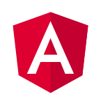

name: inverse
layout: true
class: center, middle, inverse

---

# {{{ title }}}
## {{{ subtitle }}}

.javascript-img[]

#### {{{ link }}}

---
layout: false

.left-column[
## Plan
]

.right-column[
- Rappel de l'historique du JS
- Fonctionnement des nouvelles versions du langage (proposals, stages...)
- Fonctionnalités swaggy
  - ES6 (2015)
  - ES2016
  - ES2017
  - Encore en proposals
- Tooling
  - Babel
  - Webpack
    - Parcel ?
  - ESLint
    - Standard ?
  - Prettier
- Frameworks/libs et concepts
  - Frontend
    - React
      - Redux
      - Mobx
    - Vue
      - Vuex
    - Angular
  - Backend
    - Express
    - Loopback
  - Desktop
    - Electron
      - https://github.com/zeit/hyper
      - Limites (overhead de l'install de Chrome + node, failles de sécu sur les electron pas à jour)
      - Expérimentations (utiliser le navigateur du système)
  - Les autres trucs chelous
    - https://github.com/webtorrent/webtorrent
    - WebAssembly

]

---

.left-column[
## Plan
]

.right-column[
## 1. Pourquoi ?

## 2. Comment le JS évolue-t-il ?

## 3. Les nouveautés

## 4. L'écosystème
]

---
template: inverse

# Pourquoi ?

???

Au départ, je voulais parler des frameworks JS, les différentes lib, l'écosystème...

Mais les frameworks naissent, vivent, et meurent à un moment (surtout en JS ^^),
alors que le langage est là pour rester. Si le langage est mort, tous les frameworks
du monde ne pourront pas le faire évoluer.

Pas d'inquiétude, je parlerai de l'écosystème à la fin de la présentation, pour
montrer sa richesse et toooooout ce pour quoi le JS est utilisé aujourd'hui.

---

.left-column[
## µ-historique (rappel)
]

--
count: false

.right-column[
- Javascript créé en 1995

- ECMAScript 3 sort en 1999

- ECMAScript 5 sort en 2009

- Depuis 2015 : reprise de l'évolution du langage
]

???

C'est l'année de ma naissance ! ^^

--
count: false

.right-column-no-padding[
➡ Objectif : une version par an
]

---
template: inverse

# Comment le JS évolue-t-il ?

---

.left-column[
## Évolution du langage
]

.right-column[
## 5 étapes (ou *stages*)
]

--
count: false

.right-column-no-padding[
0) Stage 0 : n'importe quelle proposition, idée ou discussion d'un changement non formalisée
]

--
count: false

.right-column-no-padding[
1) Stage 1 : **Proposal**  
Identification du problème, début de solution, cas d'usages ➡ polyfills, démos
]

--
count: false

.right-column-no-padding[
2) Stage 2 : **Draft**  
Spécification initiale, description précise de la syntaxe, des TODOs encore acceptés
]

--
count: false

.right-column-no-padding[
3) Stage 3 : **Candidate**  
Spécification complète, à tester en utilisation réelle
]

--
count: false

.right-column-no-padding[
4) Stage 4 : **Finished**  
Tests d'acceptance écrits, pull request acceptée ➡ 2 implémentations (navigateurs et/ou babel)
]

--
count: false

.right-column-no-padding[
➡ validé et écrit dans la spec officielle ECMAScript
]

---

.left-column[
## Évolution du langage
]

.right-column[
## 5 étapes (ou *stages*)

Tout ce processus est public !

La spécification : https://github.com/tc39/ecma262 (accrochez vous !)

Les propositions : https://github.com/tc39/proposals

.ecm262-img[]
]

---
template: inverse

# Les nouveautés

---

.left-column[
## ES6
]

.right-column[
- `let` et `const`

.code-multi-columns[
```js
// ES5
var PI = 3.14;
var quickMaths = false;

if (PI > 3.0) {
  var quickMaths = true;
  console.log(quickMaths); // true
}

console.log(quickMaths); // true
```
```js
// ES6
const PI = 3.14;
let quickMaths = false;

if (PI > 3.0) {
  let quickMaths = true;
  console.log(quickMaths); // true
}

console.log(quickMaths); // false
```
]
]

---
count: false

.left-column[
## ES6
]

.right-column[
- `let` et `const`

```js
// ES5
for (var i = 0; i < 5; i++) {
  var btn = document.createElement('button');
  btn.appendChild(document.createTextNode('Button ' + i));
  btn.addEventListener('click', () => console.log(i));
  document.body.appendChild(btn);
}
```
```js
// ES6
for (let i = 0; i < 5; i++) {
  var btn = document.createElement('button');
  btn.appendChild(document.createTextNode('Button ' + i));
  btn.addEventListener('click', () => console.log(i));
  document.body.appendChild(btn);
}
```
]

---
count: false

.left-column[
## ES6
]

.right-column[
- `let` et `const`
- Les *arrow functions*

➡ Écriture raccourcie  
➡ Return implicite

.code-multi-columns[
```js
// ES5
const array = [1, 2, 3, 4, 5];
const squares = array.map(function (v) {
  return v * v;
});
```
```js
// ES6
const array = [1, 2, 3, 4, 5]
let squares = array.map(v => {
  return v * v
})

// Return implicite
squares = array.map(v => v * v)
```
]
]

---
count: false

.left-column[
## ES6
]

.right-column[
- `let` et `const`
- Les *arrow functions*

➡ `this` récupéré du contexte parent

```js
// ES5
function Timer () {
  this.seconds = 0;
  setInterval(function() { this.seconds++}, 1000);
}
var timer = new Timer();
setTimeout(function() { console.log(timer.seconds) }, 3100); // 0

// Version corrigée
function Timer () {
  this.seconds = 0;
  var that = this;
  setInterval(function() { that.seconds++}, 1000);
}
```
```js
// ES6
function Timer () {
  this.seconds = 0
  setInterval(() => this.seconds++, 1000)
}
let timer = new Timer()
setTimeout(function() { console.log(timer.seconds) }, 3100) // 3
```
]

---
count: false

.left-column[
## ES6
]

.right-column[
- `let` et `const`
- Les *arrow functions*
- Les paramètres par défaut

.code-multi-columns[
```js
// ES5
function f (x, y, z) {
  if (y === undefined)
    y = 7;
  if (z === undefined)
    z = 42;
  return x + y + z;
}
f(1); // 50
```
```js
// ES6
function f (x, y = 7, z = 42) {
  return x + y + z
}
f(1) // 50
```
]
]

---
count: false

.left-column[
## ES6
]

.right-column[
- `let` et `const`
- Les *arrow functions*
- Les paramètres par défaut
- Les *rest parameters* et le *spread operator*

```js
// ES5
// Rest parameters
function join(glue) {
  var words = Array.prototype.slice.call(arguments, 1);
  return words.join(glue);
}
join(' ', 'Bonjour', 'Thomas'); // Bonjour Thomas

// Spread operator
var params = ['hello', true, 7];
var other = [1, 2].concat(params); // [1, 2, 'hello', true, 7]
```
```js
// ES6
// Rest parameters
function join(glue, ...words) {
  return words.join(glue);
}
join(' ', 'Bonjour', 'Thomas'); // Bonjour Thomas

// Spread operator
var params = ['hello', true, 7]
var other = [1, 2, ...params] // [1, 2, 'hello', true, 7]
```
]

---
count: false

.left-column[
## ES6
]

.right-column[
- `let` et `const`
- Les *arrow functions*
- Les paramètres par défaut
- Les *rest parameters* et le *spread operator*
- Les *template literals*

```js
// ES5
var customer = { name: "Foo" };
var card = { amount: 7, product: "Bar", unitprice: 42 };
var message = "Hello " + customer.name + ",\n" +
"want to buy " + card.amount + " " + card.product + " for\n" +
"a total of " + (card.amount * card.unitprice) + " bucks?";
```
```js
// ES6
const customer = { name: 'Foo' }
const card = { amount: 7, product: 'Bar', unitprice: 42 }
const message = `Hello ${customer.name},
want to buy ${card.amount} ${card.product} for
a total of ${card.amount * card.unitprice} bucks?`
```
]

---
count: false

.left-column[
## ES6
]

.right-column[
- `let` et `const`
- Les *arrow functions*
- Les paramètres par défaut
- Les *rest parameters* et le *spread operator*
- Les *template literals*
- Syntaxe raccourcie pour les objets

```js
// ES5
var prenom = 'Justin';
var nom = 'Bieber';
var chanteurPrefere = 'lui-même';
var person = {nom: nom, prenom: prenom};
person['disques de ' + chanteurPrefere] = 42;
```
```js
// ES6
const prenom = 'Justin';
const nom = 'Bieber';
const chanteurPrefere = 'lui-même'
const person = {nom, prenom, [`disques de ${chanteurPrefere}`]: 42}
```
]

---
count: false

.left-column[
## ES6
]

.right-column[
- ...
- Destructuration

```js
// ES5
var list = [ 1, 2, 3 ];
var a = list[0], b = list[2];
var tmp = a; a = b; b = tmp;

var person = getPersonFromDb();
var prenom = person.prenom;
var nom = person.nom;
var age = person.age === undefined ? 42 : person.age

function f(value, opts) {
  var follow = opts.follow;
  var force = opts.force;
}
```
```js
// ES6
const list = [ 1, 2, 3 ]
let [ a, , b ] = list
[ b, a ] = [ a, b ]

const {prenom, nom, age = 42} = getPersonFromDb()

function f(value, { follow, force }) {}
```
]

---
count: false

.left-column[
## ES6
]

.right-column[
- ...
- Modules

```js
// ES5
//  lib/math.js
LibMath = {};
LibMath.sum = function (x, y) { return x + y };
LibMath.pi = 3.141593;

//  someApp.js
var math = LibMath;
console.log("2π = " + math.sum(math.pi, math.pi));

//  otherApp.js
var sum = LibMath.sum, pi = LibMath.pi;
console.log("2π = " + sum(pi, pi));
```
```js
// ES6
//  lib/math.js
export const sum = (x, y) => x + y
export const pi = 3.141593

//  someApp.js
import * as math from "lib/math"
console.log("2π = " + math.sum(math.pi, math.pi))

//  otherApp.js
import { sum, pi } from "lib/math"
console.log("2π = " + sum(pi, pi))
```
]

---
count: false

.left-column[
## ES6
]

.right-column[
- ...
- Classes

.code-multi-columns[
```js
// ES5
var Shape = function (id, x, y) {
    this.id = id;
    this.move(x, y);
};
Shape.prototype.move = function (x, y) {
    this.x = x;
    this.y = y;
};


var Rectangle = function (id, x, y, width, height) {
    Shape.call(this, id, x, y);
    this.width  = width;
    this.height = height;
};
Rectangle.prototype = Object.create(Shape.prototype);
Rectangle.prototype.constructor = Rectangle;
var Circle = function (id, x, y, radius) {
    Shape.call(this, id, x, y);
    this.radius = radius;
};
Circle.prototype = Object.create(Shape.prototype);
Circle.prototype.constructor = Circle;
```
```js
// ES6
class Shape {
  constructor (id, x, y) {
    this.id = id
    this.move(x, y)
  }
  move (x, y) {
    this.x = x
    this.y = y
  }
}
class Rectangle extends Shape {
  constructor (id, x, y, width, height) {
    super(id, x, y)
    this.width  = width
    this.height = height
  }
}
class Circle extends Shape {
  constructor (id, x, y, radius) {
    super(id, x, y)
    this.radius = radius
  }
}
```
]
]

---
count: false

.left-column[
## ES6
]

.right-column[
- ...
- Promesses

.code-multi-columns[
```js
// ES5
// Si fetch utilisait des callbacks
fetch('users/nymous', (err, user) => {
  if (err)
    return console.error(err);
  fetch('posts/' + user.userId, (err, posts) => {
    if (err)
      return console.error(err);
    console.log(posts)
  };
})

getUserFromDb('nymous', (err, user) => {
  getGithubOfClass('ebm', (err, github) => {
    console.log(user, github)
  }
})
```
```js
// ES6

fetch('users/nymous')
  .then(user => fetch(`posts/${user.userId}`))
  .then(posts => console.log(posts))
  .catch(err => console.error(err))


Promise.all([
  getUserFromDb('nymous'),
  getGithubOfClass('ebm')
])
  .then(([user, github]) => {
    console.log(user, github)
})
```
]
]

---
count: false

.left-column[
## ES6
]

.right-column[
Mais encore :
- Générateurs

- Symboles

- Map, Set, WeakMap et WeakSet

- Des méthodes bonus sur les Strings et les Arrays

- ...
]

---

.left-column[
## ES6
## ES2016
]

???

À partir de ES7, on doit utiliser la nomenclature ES + année de sortie

--
count: false

.right-column[
- `Array.prototype.includes`

- L'opérateur puissance

```js
[1, 2, 3].includes(3); // true

2 ** 5 === Math.pow(2, 5); // true
```
]

--
count: false

.right-column[
Et c'est tout...
]

---

.left-column[
## ES6
## ES2016
## ES2017
]

---
count: false

.left-column[
## ES6
## ES2016
## ES2017
]

.right-column[
- String padding

```js
'Nymous'.padStart(10) === '    Nymous';
'Nymous'.padStart(10, x) === 'xxxxNymous';
'Nymous'.padEnd(10) === 'Nymous    ';
```

*cf l'affaire left-pad*
]

---
count: false

.left-column[
## ES6
## ES2016
## ES2017
]

.right-column[
- String padding
- `Object.values` et `Object.entries`

```js
const obj = {key: 'value', name: 'Thomas', age: 22}
Object.values(obj) === ['value', 'Thomas', 22]

Object.entries(obj) === [['key', 'value'], ['name', 'Thomas'], ['age', 22]]
```
]

---
count: false

.left-column[
## ES6
## ES2016
## ES2017
]

.right-column[
- String padding
- `Object.values` et `Object.entries`
- async/await

.code-2-columns[
```js
fetch('users/nymous')
  .then(user => fetch(`posts/${user.userId}`))
  .then(posts => console.log(posts))
  .catch(err => console.error(err))
```
```js
try {
  const user = await fetch('users/nymous')
  const posts = await fetch(`posts/${user.userId})
  console.log(posts)
} catch(err) {
  console.error(err)
}
```
]
]

---

.left-column[
## ES6
## ES2016
## ES2017
## ES.Next
]

.right-column[
Stage 3 :
- `import()` asynchrone
- Méthodes privées dans les classes

Stage 2 :
- Méthodes statiques
- Décorateurs

Stage 1 :
- Optional chaining

```js
const town = user && user.address && user.address.town
const town = user?.address?.town
```
- Pipeline operator

```js
let result = exclaim(capitalize(doubleSay('hello')))
result === 'Hello, hello!'

let result = 'hello'
  |> doubleSay
  |> capitalize
  |> exclaim
result === 'Hello, hello!'
```
]

???

Stage 3 = quasi sûr d'arriver, sauf qu'une fois une feature en stage 3 était prête à être acceptée, jusqu'à ce qu'un dev arrive avec son cas d'usage qui ne marchait pas, le cas a été retenu et toute la spec est repartie en stage 0 pour réflexion complémentaire

---
template: inverse

# L'écosystème

---

.left-column[
## Les outils
]

.right-column[
## La sainte trinité

### Babel
.babel-img[]
Transpilation (JS-to-JS), pour utiliser les nouvelles fonctionnalités même dans les vieux navigateurs

Alternative : bublé
]

--
count: false

.right-column-no-padding[
### Webpack
.webpack-logo[]
Gestion de toutes les ressources dans un projet frontend

Alternatives : Rollup, Parcel, Browserify
]

--
count: false

.right-column-no-padding[
### ESLint
.eslint-img[]
Analyse statique du code, respect de certaines règles de formatage ou de syntaxe

À combiner avec : Prettier
]


---

.left-column[
## Les outils
## Le frontend
]

.right-column[
### React
.react-img[]
Bibliothèque d'affichage, développée par Facebook  
Syntaxe JSX

Fait *juste* l'affichage, il faut assembler des briques tierces  
Écosystème énorme ! Mais pas de lib de référence (trop de choix ?)  
Courbe de difficulté moyenne
]

???

Exemple de briques tierces React : routeur, services HTTP, gestion d'état...  
Redux/Mobx, React-routeur, react-final-form, super-agent/axios

--
count: false

.right-column-no-padding[
### Angular
.angular-img[]
Framework frontend, développé par Google  
Syntaxe TypeScript

Fait tout ! (c'est un framework)  
Propose *la bonne manière* de structurer une application  
Courbe de difficulté grande (syntaxe TS, surface de l'API)
]

--
count: false

.right-column-no-padding[
### Vue
.vue-img[]
Bibliothèque d'affichage, soutenue par Alibaba  
Templates HTML (mais JSX et Typescript possibles)

Fait à peut près autant que React  
Écosystème moins développé ; des libs *conseillées* mais on peut dévier de la norme  
Courbe de difficulté faible
]

???

Courbe de difficulté de vue : on peut juste charger `<script src="vue.min.js">` sans perdre trop de performances

---

.left-column[
## Les outils
## Le frontend
## Le backend
]

.right-column[
### Express
.express-img[]
Le serveur HTTP *de facto* pour node  
Fonctionne grâce à des middlewares  

Peut tout faire
]

--
count: false

.right-column-no-padding[
### Loopback
.loopback-img[]
Conçu par-dessus Express, pour développer des API  
CLI disponible pour créer des ressources, des routes...  
Interface d'administration générée automagiquement
.loopback-admin-img[]
]

???

Loopback me fait penser un peu à Rails, avec la CLI pour générer un nouveau modèle, un contrôleur...

---
template: inverse

# The end

### {{{ link }}}

---

.left-column[
## Sources
]

.right-column[
- Wikipédia : [ECMAScript](https://en.wikipedia.org/wiki/ECMAScript), [JavaScript](https://en.wikipedia.org/wiki/JavaScript), [WebAssembly](https://en.wikipedia.org/wiki/WebAssembly)
- [Présentation du JS en 2016](https://tdd.github.io/js-nocturnes-federez) par Christophe Porteneuve, et la [partie 2](https://github.com/tdd/js-nocturnes-federez/blob/gh-pages/episode-2-ecosysteme.pdf)
- [Process d'acceptation](https://tc39.github.io/process-document/) des modifications d'ECMAScript
- [Les nouveautés de ES2015+](http://es6-features.org/), avec des exemples de code
- Des [articles](https://github.com/bevacqua/es6) sur lesdites nouveautés
]

---

.left-column[
## Sources
## Pour aller plus loin
]

.right-column[
- Un gros bouquin pour réapprendre le Javascript, [You don't know JS](https://github.com/getify/You-Dont-Know-JS)
- [Promisees](https://bevacqua.github.io/promisees/), un joli site pour comprendre dans quel sens fonctionnent les promesses
- [TypeScript](https://github.com/Microsoft/TypeScript), le superset de JS développé par Microsoft, avec comme ajout principal un typage statique (et d'autres bonus)
- [Flow](https://flow.org/), une alternative au typage de TypeScript, développé par Facebook
- [Yarn](https://github.com/yarnpkg/yarn), un gestionnaire de package alternatif à npm et développé par Facebook
- [Gatsby](https://www.gatsbyjs.org/), un générateur de site statique en React
- [PhantomJS](https://github.com/ariya/phantomjs), un navigateur sans interface graphique (très utile pour les tests)
- [Prettier](https://prettier.io/), un outil pour reformater le code automatiquement
- La [Awesome List sur NodeJS](https://github.com/sindresorhus/awesome-nodejs), celle sur [Javascript](https://github.com/sorrycc/awesome-javascript) et la [liste des Awesome Lists](https://github.com/sindresorhus/awesome) en général
- Des [bons conseils](https://github.com/wearehive/project-guidelines) pour organiser un projet Javascript backend (une moitié des conseils peut être réutilisée dans d'autres projets)
- Une autre liste de [best practices](https://github.com/i0natan/nodebestpractices)
- [Un tutoriel](https://github.com/verekia/js-stack-from-scratch) pour construire un projet JS frontend *from scratch*, de la conf Webpack à React en passant par les tests
- Une [cheatsheet](https://github.com/mbeaudru/modern-js-cheatsheet) de la nouvelle syntaxe ES2015+
- Un guide de la [programmation fonctionnelle](https://github.com/MostlyAdequate/mostly-adequate-guide) en JS
- [WebAssembly](http://webassembly.org/), un format d'exécutable binaire implémenté dans les navigateurs
- Article de Bastien Huber sur [Loopback](https://huberisation.eu/articles/brainstorming-app-part-1-loopback)
]
